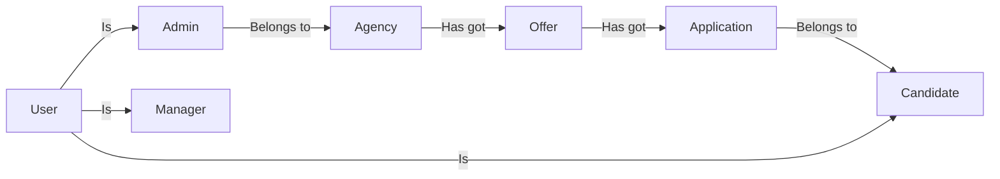

# Bibiane-Travels Server REST API

## ENTITIES RELATIONAL MODELLING AND DEPENDENCY

The application is modeled according to the relational diagram below:

This can be enterpreted as:

- A user **_can be_** a manager, an admin or a candidate.
- An admin **_belongs to_** an agency.
- An agency **_has got_** offers.
- An offer **_has got_** applications.
- An application **_belongs_** to a candidate.

It's normally a 2 ways relational diagram because:

- We can say an Admin belongs to an agency and an agency has got admins.
- We can say an offer has got applications and an application belongs to an offer.
- We can say an agency has got offers and an offer belongs to an agency.
  ...etc

But we are not considering the both ways. We are relying a SINGLE WAY relationship. This is because we are trying to avoid circular dependencies and trying to keep the code clean and easy to understand. So, we only consider the way represented in the diagram above.

Dependency Vs Dependent:

- **Dependency**: The class that is needed to create the other class. It is the one that can be created without the other.
- **Dependent**: The class that needs the other class to be created. It is the one that cannot be created without the other.

NOTE: It's **the dependent class** that **links** (using beanie's LINK) to the dependency and the **dependency class backlinks** to the dependent class using beanie's **BACKLINK**. This is because the dependent class needs to know about the dependency class but not the other way around.

Later on we'll talk about ways to avoid circular dependency and you'll see that it's the **DEPENDENCY** that **can import** the other class and the **DEPENDENT** must **forward references** of the other class.

Ex: `Agency` is a dependency of `Offer` because we can create an agency without listing its offers. But we cannot create an offer without saying which agency posted it. So `Offer` is a dependent class of `Agency`.
Ex: `Offer` is a dependency of `Application` because we can create an application without saying which offer it belongs to. But we can create an offer without listing its applications yet.

We can group relations into 2 kinds:

- `Belongs To` relationship:
  The class in the left of the `-->` is the dependent class and the class in the right of the `-->` is the dependency class.
  In other words:

  - The class that is the owner is the dependency class.
  - The class that is the one that is owned is the dependent class.

- `Has Got` and `Is` relationships:
  The class in the left of the `-->` is the dependency class and the class in the right of the `-->` is the dependent class.

### How are we avoiding circular dependency?

#### 1. Strict one way dependency and forward references

Case example: An agency `Has got` admin and an admin `Belongs to` an agency. Looks like we need a **TWO WAYS** (<->)relationship here: `AGC -> ADM` and `ADM -> AGC`. Though this will cause dependency issues like: Models that import each other.

That’s why we've imposed a **strict ONE WAY** relationships between entities answering the question: **"Which entity can be created without the other?"**.

- We can create an agency without listing its offers but we cannot create an offer without saying which agency posted it.

So Agency is a DEPENDENCY class of the DEPENDENT class Offer. In this case, following the rule we set **"DEPENDENCY class imports and DEPENDENT class uses forward refs"** and THE STRICT ONE WAY dependency rule, Agency can import from Offer but not the other way around. This way we can avoid circular dependencies.

#### 2. Moving reusable sub models to utils files

Each entity Model has a utils file. The utils file contains utility sub models that are reusabled and can also be used in other entities' main models files. To avoid circular dependencies, we can only import the utils file in the main models files but never the other way around.

**"The models.utils files cannot import from main model or any other model's main files. Ex: offer.utils cannot import from offer.offer neither from application.application or agency.agency. On top of that projection files can import from any other file AND cannot be imported by anyone. They are used only in routes"**.

#### 3. Using Generic classes

We can use generic classes to avoid circular dependencies. For example, if we have a class that needs to reference another class, we can use a generic type instead of importing the class directly. This allows us to define the relationship between the classes without creating a circular dependency.
NOTE: We are mostly using Generic type to avoid module's utils to import from other modules's utils.

### Loading forwarded refs and rebuilding models

For the application to run we need to load the forwarded refs and rebuild the models that forwarded them. It's may happened that the forwarded ref's model also forwards some refs itself. In that case, before we rebuild the model, we need to make sure that the forwarded ref's model is fully loaded (everything it forwared is loaded, resolved and is rebuilt).

This implies that, to resolve forwarded refs, we must rebuild the models following a specific order. To choose which model to rebuid first, we answer the question: **"Whose references are ready to load? In other words: Whose references nolonger have refs to be resolved?"**

Note about inheritance:
When a model inherits from a mother model that forwards some refs, after the mother's forwarded refs are loaded and/or resolved, we must rebuild not only the mother model but also all its children models.

So far, the best order is:

Agency and User don't need rebuildind since they don't forward

1. Rebuild Admin because it forwards User and Agency and these two don't forward anything.
2. Rebuild Manager because it forwards User and User doesn't forward anything.
3. Rebuild Candidate because it forwards User and User doesn't forward anything.
4. Rebuild Offer because it forwards Agency and agency doesn't forward anything.
5. Rebuild Application because it forwards Candidate and Offer and at this point they're both loaded at step 3 and 4

### Projections

**A. Based on ACCESS LEVELS**

- **Public**: Public informations anyone can accessed even unauthentificated users
- **Authentificated**: Public + Informations only loggedin users can accessed
- **Private**: Informations only authorised members can accessed

**B. Based on NESTING LEVELS**

- **Basic**: Only one or two _key_ fields (Like: id, username, name). Contains only public friendly fields because we don't apply access restrictions on these fields.

- **Flat**: All direct children + _Basic versions_ of nested fields.
- **Shallow**: All direct children + _Flat versions_ of nested fields.
- **Deep (Not to be used for now)**: All direct children + _Shallow versions_ of nested fields.

_**About basicProj**_(TODO): Considere adding offer_id and user_id (flattened linked documents ids). But this would force basicProjs to fetch with nestingdepth 1, flatproj up to 2 and shallow up to 3. And this is tooo much expensive in term of dn data transfer. expecially becasuse we're almost projecting in python side by using aggreagation.

**C. Merged (ACCESS LEVELS x NESTING LEVELS)**

Since we don't apply access-level restrictions on Basic Projections and since we Deep projections are not usef for now, we only consinder Flat and Shallow Projections for this merging.

- _**PublicFlat**_: Public x Flat. Inherits from Basic.

  - Contains data accessible by anyone (Public)
  - Includes Basic versions nested fields.
  - Is used for nested fields in Shallow Projection.

- _**PublicShallow**_: Public x Shallow. Inherits from PublicFlat.

  - First contains everything in PublicFlat.
  - Includes Flat versions public nested fields.

- _**AuthentificatedFlat**_: Authentificated x Flat. Inherits from PublicFlat.

  - Contains everything in PublicFlat
  - Adds direct fields retricted to authenticated users

- _**AuthentificatedShallow**_: Authentificated x Shallow. Inherits from PublicShallow and AuthentificatedFlat.

  - First contains everything in PublicShallow and AuthentificatedFlat
  - Then adds Authenticated versions of nested fields

- _**PrivateFlat**_: Private x Flat. Inherits from AuthentificatedFlat.

  - Contains everything in AuthentificatedFlat
  - The adds direct fields retricted to users with authorisation

- _**PrivateShallow**_: Private x Shallow. Inherits from PrivateFlat and AuthentificatedShallow

  - First contains everything in PrivateFlat and AuthentificatedShallow
  - Then adds Private versions of nested fields

TODO:

- Allow expansion of some 3rd level nested fields when necessary. Es: allow expansion of agency field when getting user.
- List fields should be replaced by an object with stats of the entity when embedded in another entity. Es: when getting an agency, the list of offers should be replaced by agency stats of the offers.

## ROLES AND PERMISSIONS

**SUPPERMANAGER**: Top-level system admin
**MANAGER**: Low-level system admin
**PARTNER**: (AGENCY SUPER ADMINS) Top-level agency admin. They are the owners or co-owners of the agency.
**ADMIN**: (AGENCY CLASSIC ADMINS) Low-level agency admin. They are the dependents of the agency owners.
**CANDIDATE**: Any user that can apply for to an offer.

But when it comes to authorization, a Partner and a classic admin are almost the same. They are both admins. Same goes for `MANAGER` and `SUPPERMANAGER`. The thing that **makes the difference in authorization is the permissions**. So we can say that we have 4 roles and 2 super roles. For example, in the CurrentUser class, we have 3 boolean variables: `is_candidate`, `is_manager`(and manager or SUPPERMANAGER) and `is_admin`(any partner or classic admin). And then we check permissions for feature access.

1. Creation of an Agency

An agency can be created by:

- By an unauthentificated user.
  In this case, The request MUST contain the information about the PARTNER.
  This means that, in this case the system considers the one creating the agency as the owner.
  In this case, the servers returns the `ACCESS TOKEN` of the newly created agency owner.

- By an authorised NANAGER.
  **MANAGER** who have the permission `agency:create` can create an agency from their systems.
  In that case they are also supposed to send the information about the agency owner.
  But instead of returning a `ACCESS TOKEN`, the system sends an emails to the agency owner asking him to update its password.

1. Creation of Admin

- Classic ADMINS Can be created by:

  - **PARTNERS** (Agency owners)
  - **NANAGERS** (in case of request of assistance)

- PARTNERS (Agency owners | Super admin) can be created by:
  - **THEMSELVES** in the process of created an new agency
  - **NANAGERS** (in case of request of assistance)

## OAUTH

The token payload is managed by two classes: `TokenPayload` from models.oauth and `CurrentUser` from models.user. The `TokenPayload` is the one thta extends the oauth2 module's `TokenPayloadBase` class. It is used to create the token and to decode it. The `CurrentUser`class extends `TokenPayload` and brings additional informations about roles, permissions etc. Use `CurrentUser` when dealing with deap permissions and roles. Use `TokenPayload` when dealing with basic token information. Note the `CurrentUser` class has complex logic. Foe efficiency use ir only when needed.

Permission is a string like `offer:crud` or `agency:r`. The first part is the entity and the second part is the actions list. The action can be one of the following: `c` (create), `r` (read), `u` (update), `d` (delete). The permission is managed by the `Permission` class. But the user's permissions are managed by the `CurrentUser` class. Permission are managed has a list of Permission (List[Permission]).

## EXCEPTIONS HANDLING

We are already catching most of the exceptions in the main.py file. It's better since we keep the catching logics at a central place. But sometime when needed we can catch exceptions in the routers before reraising them. For example if you want to do some rollback if some insertions failed.
